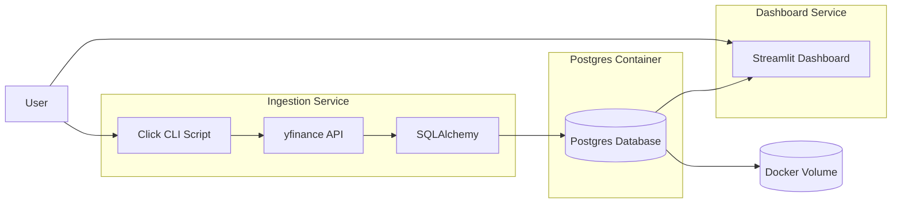

# Stock Data Pipeline & Visualisation
## Overview
This project is a containerised data pipeline designed to fetch financial data from Yahoo Finance, process it into a PostgreSQL database and visualise using Streamlit.

## Architecture


## Technologies Used
Language: Python 
- yfinance - API ingestion
- pandas - data transformation
- SQLAlchemy - database abstraction
- Click - CLI configuration

Database: PostgreSQL
- pyscopg2 driver

Dashboard: Streamlit

Containerisation: Docker & Docker Compose

Package Management: pyproject

## Quick Start
### Prerequisites
- Docker

### Installation
1. Clone the repository
```
git clone https://github.com/ChrisP972/stock-data-pipeline.git
cd stock-data-pipeline
```

2. Start all services
```
docker compose up --d
```

3. Access the dashboard at [http://localhost:8501](http://localhost:8501)

## Usage
### Pipeline Parameters
For example parameters that can be passed to yfinance, refer to the [yfinance documentation](https://ranaroussi.github.io/yfinance/reference/api/yfinance.download.html).

| Option       | Description       | Default |
|-------------|--------------------|---------|
| `--ticker`  | Stock ticker       | AAPL    |
| `--period`  | Time period        | 2y      |
| `--interval`| Time interval      | 1d      |

### Running Pipeline for Additional Stock
```
docker compose run --rm collect --ticker MSFT --period 1y --interval 1d
```

### Stop & Remove Data
```
docker compose down -v
```

## Project Structure
```
stock-data-pipeline
├── app
│   ├── collect_stock_data.py       # Handles Yfinance API calls and ingestion into database
│   ├── db.py                       # Handles Postgres database
│   ├── display.py                  # Handles Streamlit dashboard
├── docker-compose.yaml             # Docker services configuration
├── Dockerfile                      # Docker container instructions
├── pyproject.toml                  # Python project configuration
├── uv.lock                         # UV dependency lock file
```

## Improvements
- Dashboard: Date range filter, advanced metrics, ticker comparison, multiple series selection, KPIs
- CI: Add automated testing on every push to GitHub
- Cloud Deployment: Managed db, Terraform
- Scheduling
- Data Transformation